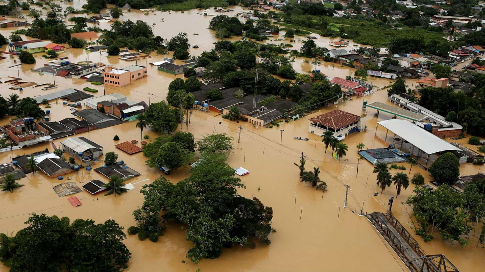
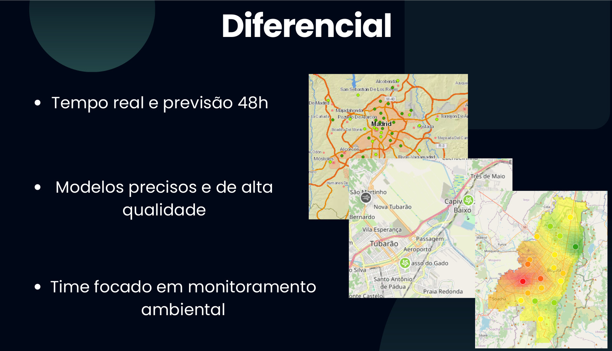
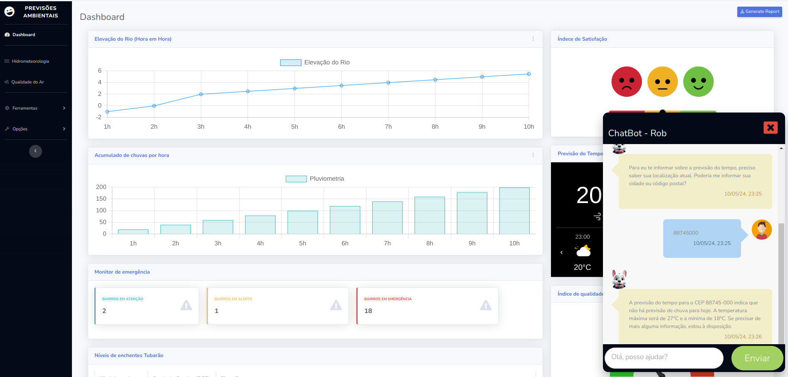

# Prevendo o Imprevisível: IA para Alertas e Monitoramento de Eventos Climáticos Extremos

As mudanças climáticas nos trouxeram um desafio urgente: lidar com eventos climáticos extremos cada vez mais frequentes e intensos. Enchentes devastadoras, como as que vimos recentemente no Rio Grande do Sul, exigem soluções inovadoras para proteger vidas, infraestruturas e o meio ambiente.

Este projeto, desenvolvido para Imersão Inteligência Artificial 2ª Edição, utiliza o poder da Inteligência Artificial para ir além dos métodos tradicionais de monitoramento, criando um sistema inteligente de alertas e previsões para eventos climáticos extremos. O desenvolvimento é realizado utilizando Python, Flask, Folium para visualizações interativas de mapas, e Google Gemini para Large Language Models (LLM), proporcionando uma base robusta e escalável para análise e interação de dados.

## Visão Computacional: Olhando o Clima por Novos Ângulos

Imagine um sistema que "enxerga" a iminência de uma enchente, mesmo sem sensores no local. Com IA e visão computacional, isso é possível! Nosso projeto utiliza imagens e vídeos para treinar modelos de IA capazes de:

- **Analisar Imagens de Cheias com `analisarImagensCheias.py`:** Este arquivo contém o modelo treinado com várias imagens de cheias e seus respectivos níveis dos rios. Usuários podem enviar fotos de enchentes, e o modelo retorna o nível estimado do rio. Essa funcionalidade é crucial, pois em muitos casos, os sensores de nível são levados pelas enchentes.

## Integrando Dados de Pesquisa para Respostas Precisas

Nosso projeto também aproveita informações contidas em documentos PDF gerados por cientistas que estudaram as bacias dos rios, como a Defesa Civil de SC, e especialistas ambientais em qualidade do ar, como o IEMA. O arquivo `analisarDocumentos.py` processa esses documentos, incluindo estudos sobre a bacia hidrográfica do rio Tubarão, dados sobre as últimas enchentes e documentos do IEMA sobre a qualidade do ar no Brasil. Esses documentos enriquecem nosso banco de dados, permitindo que a IA ofereça respostas e previsões baseadas em pesquisas e estudos aprofundados sobre as condições específicas de cada região.

## Respirando Soluções Inteligentes: IA para Monitorar a Qualidade do Ar

A qualidade do ar é outro fator crítico impactado pelas mudanças climáticas e pela ação humana. Nosso projeto utiliza IA para:

- **Prever a Qualidade do Ar:** Analisando dados de sensores de qualidade do ar em diferentes locais, o modelo pode prever a qualidade do ar em áreas sem sensores, fornecendo informações importantes para a saúde pública e para a tomada de decisões preventivas.
- **Alertar sobre Poluição:** A IA identifica áreas com maior probabilidade de sofrer com a poluição do ar, permitindo que gestores tomem medidas preventivas para proteger a saúde da população, especialmente os grupos mais vulneráveis.

## Um Chatbot para Conectar Pessoas e Soluções

Para tornar as informações acessíveis a todos, o projeto inclui um chatbot inteligente, capaz de responder a perguntas como:

- "Vai chover hoje?"
- "Qual a previsão de cheia para o meu bairro se continuar chovendo?"
- "Onde encontro informações e ajuda dos órgãos competentes?"
- "Onde posso fazer doações para ajudar as vítimas das enchentes?"

Este chatbot também auxilia a população em perigo e gestores com previsões baseadas nos modelos de IA e nos dados integrados, proporcionando respostas rápidas e ações preventivas.

## Integração e Orquestração com `webhook.py`

O arquivo `webhook.py` serve como o ponto de partida da nossa API, responsável pela orquestração das chamadas e interações dentro do sistema. Utilizando o framework Flask, este arquivo configura a aplicação web e define as rotas para as diversas funcionalidades, desde a visualização de mapas até a interação por chat.

Este script também integra o Google Gemini para LLM, configurando o ambiente para utilização do modelo generativo de linguagem. Ele garante a segurança e a precisão das respostas fornecidas pelo chatbot, aplicando configurações de segurança rigorosas e aproveitando a avançada capacidade de geração de conteúdo do Gemini para responder de forma inteligente e contextualizada às entradas dos usuários.

### Destaques do `webhook.py`:

- **Configuração do Flask e CORS:** Inicializa o servidor web e permite requisições de diferentes origens.
- **Integração com Gemini:** Utiliza a API do Google Gemini para criar modelos de linguagem generativos, proporcionando respostas precisas e contextuais através do chatbot.
- **Rotas Dinâmicas:** Define rotas específicas para funcionalidades de hidrometeorologia e qualidade do ar, cada uma gerando visualizações interativas e relevantes.

Este arquivo é essencial para o funcionamento fluido e seguro do sistema, assegurando que todas as partes da aplicação se comuniquem harmoniosamente e que as respostas geradas sejam de alta qualidade e seguras para os usuários.

## Um Futuro Mais Seguro e Resiliente com IA

Acreditamos que a inteligência artificial tem um papel fundamental na construção de um futuro mais seguro e resiliente diante das mudanças climáticas. Este projeto é um passo importante nessa direção, unindo tecnologia e informação para proteger vidas, o meio ambiente e construir um futuro mais sustentável.

**Vote neste projeto e ajude-nos a construir um futuro mais seguro para todos!**
